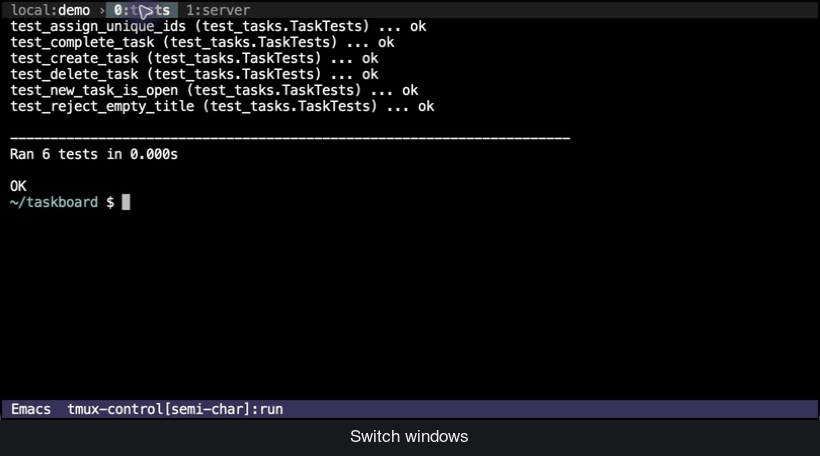
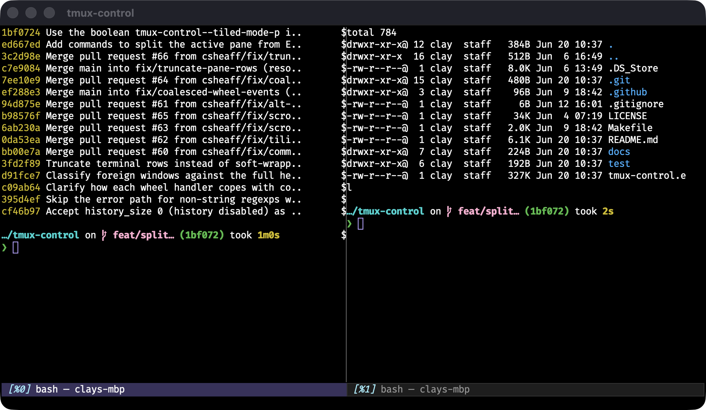
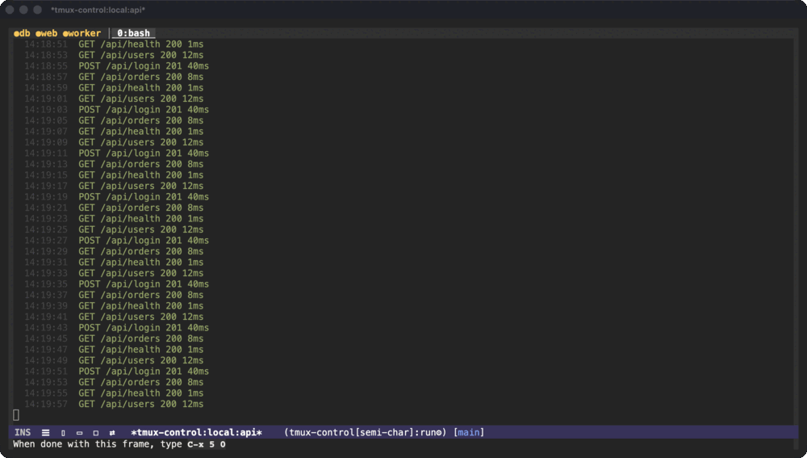

# tmux-control

[](https://github.com/csheaff/tmux-control/actions/workflows/ci.yml)

`tmux-control` turns Emacs into a **control-mode client for a tmux pane** —
the [iTerm2 tmux-integration](https://iterm2.com/documentation-tmux-integration.html)
idea, but in Emacs.



*A live tmux session in Emacs. Each window is a **tab** in the header line,
flipped with one key (`C-c C-n`); a **dot** marks a background window with new
output. Other connected sessions that want you are **named in the right corner**
— click one to jump there. Every pane is just an Emacs buffer you can search and
copy from.*

Other ways to pair Emacs with tmux either **send it commands**
([`emamux`](https://github.com/emacsorphanage/emamux)), **navigate** between
Emacs windows and tmux panes when Emacs itself runs *inside* tmux
([`tmux-pane`](https://github.com/laishulu/emacs-tmux-pane)), or run tmux
*inside* an Emacs terminal buffer (`vterm`, `eat`, `ansi-term`) — a terminal in
a terminal, with tmux's own status bar and prefix keys.  None of them render
tmux's own panes as Emacs buffers.  `tmux-control` does: it speaks tmux's
**control-mode protocol** (`tmux -C`, the same one iTerm2's native integration
uses), so each live pane becomes an Emacs buffer rendered through
[Eat](https://codeberg.org/akib/emacs-eat) — no nested terminal, no tmux
chrome, just a buffer you navigate, search, and copy from.  The session lives
on a **persistent, possibly remote** server and outlives Emacs: detach,
restart, or reconnect from another machine and the pane is still there.

## Requirements

- **Emacs 29.1+**
- **[Eat](https://codeberg.org/akib/emacs-eat) 0.9.4+** — the terminal renderer
  and a hard dependency (`straight`/`package.el` pulls it in automatically).
- **tmux 3.x** on the target host, local or remote over SSH (flow control needs
  3.2+).
- macOS or Linux.

## Install

```elisp
(use-package tmux-control
  :straight (tmux-control :type git :host github :repo "csheaff/tmux-control")
  :custom
  ;; Connection defaults for `M-x tmux-control-connect' — these are examples;
  ;; set them to your own host / socket / session.
  (tmux-control-default-host "dev")          ; an SSH host alias, or nil for local
  (tmux-control-default-socket-name "main")
  (tmux-control-default-session "emacs"))
```

Then `M-x tmux-control-connect`.  The session prompt completes over the
sessions that already exist on the chosen host and socket; selecting one
attaches, typing a new name creates it.

## What it does

- **Live view of a tmux window**, rendered through [Eat](https://codeberg.org/akib/emacs-eat)
  — a normal Emacs buffer you move, search, and copy in, with no nested
  terminal and no tmux chrome.
- **Windows as tabs** in a header-line tab bar, prefixed with a persistent
  `host:session` label so you always know which server and session you are
  looking at, with an activity **dot** on
  background windows; flip them like browser tabs (`C-c C-n` / `C-c C-p`),
  jump straight to one with `C-c 0`…`C-c 9`, or pick from a chooser (`C-c C-w`).
  Each visited window keeps its own scrollback across flips and **keeps
  streaming in the background** — flip back and see everything it printed
  while you were away.
- **Switch between sessions** on the host in place (`C-c C-s`) — each tmux
  session is its own buffer with its own scrollback and tabs. Other connected
  sessions with unseen output are **named in the right corner** of the header
  (grouped by server, so a host is shown once and only when it differs from
  the one you're viewing) — you see *which* session wants you, not just that
  one does; click a name (or `M-x tmux-control-switch-to-flagged`) to jump
  there. Or tile **every session at once** in a live grid (`C-c C-f`,
  experimental).
- **Scrollback** as ordinary Emacs text (`C-c C-e`) — opens instantly however
  deep the history (loaded lazily, extended as you scroll), faithful by
  default, with opt-in compaction of repeated full-screen redraws (toggle with
  `c`). Optionally, scroll the live view's own history in place, iTerm-style,
  rather than opening the pager — off by default, so the feel call is yours to
  make.
- **Tiled view** (`C-c C-t`, experimental) — every pane of a window at once,
  split to match tmux's layout.
- **Split a pane from Emacs** — `C-c |` (side by side) or `C-c -` (stacked)
  opens a second terminal beside the current one, tiled so both show at once.
- **Persistent & remote** — the session lives on the server and outlives Emacs;
  detach, restart, reconnect from another machine.
- **Optional full TRAMP context** — enable `tmux-control-pane-directory-mode`
  to keep `default-directory` synchronized with the active pane, making
  directory-aware commands such as compile, grep, Consult, and project tools
  naturally operate on the pane's host.
- **Stays responsive** under a flood of output (optional flow control).



*Two panes of one tmux window, side by side — each a live Emacs buffer you
search and copy in, labelled by its pane id in the mode line. Split the active
pane from Emacs with `C-c |` (side by side) or `C-c -` (stacked); both show at
once in the tiled view (experimental).*



*Each connected tmux session is its own buffer; the header corner names the ones
with new output, and `C-c C-f` tiles them all into one live grid (experimental).*

→ Full command and key reference, the tiled view, and tuning live in
**[docs/guide.md](docs/guide.md)**.

## Status

The **single-pane client is stable** and in daily use: attach (local or remote
over SSH), live render through Eat, input, resize, window tabs, scrollback with
redraw-compaction, optional flow control.  Mouse handling and broader edge-case
hardening are still in progress.

The **tiled view** (`C-c C-t`) is **experimental** — whole-frame only, with a
few [known limits](docs/guide.md#tiling) — but renders every pane cell-for-cell
with live per-pane I/O and automatic re-tiling.

## Troubleshooting

**If the live view ever drifts a row or looks scrambled**, press **`C-c C-l`**
(`M-x tmux-control-clear-and-repaint`) — it reseeds the buffer from tmux's own
screen and clears the glitch instantly.  The cause is a bug in Eat's terminal
emulation that drops a display row when a full-screen TUI repaints, so the
offset can accumulate over redraws; it's tracked upstream at
[emacs-eat#263](https://codeberg.org/akib/emacs-eat/issues/263).

To heal it **automatically** instead, set `tmux-control-auto-heal-drift` to
non-nil: an idle check then compares the rendered screen to tmux's own and
reseeds a drifted pane on its own.  It's off by default because the check costs
one `capture-pane` round trip per burst of output (taken only when a pane is
displayed, idle, and on the normal screen) — fine on a fast link, your call on
a slow one; see the variable's docstring for the exact gating.

## Terminal agent frameworks

Some CLI coding-agent tools run a session per agent in tmux — one **pane** per
agent, or one **window** per agent.  Because tmux-control renders the tmux
session itself, those layouts show up as tiled buffers and window tabs (with
the activity dot flagging which one wants you), with no special handling.  If
that's of interest, see **[docs/agents.md](docs/agents.md)**; if it isn't, you
can ignore it entirely — none of the above depends on it.

## Development

```sh
make test          # pure-logic unit tests (no tmux server required)
```

`eat` must be on the load path; pass `EAT_DIR=/path/to/eat` if it isn't at the
straight.el default.  The live render-fidelity suites (`make test-integration`
and a GUI tiling oracle) are described in the
[guide](docs/guide.md#development).

## License

GPL-3.0-or-later. See [LICENSE](LICENSE).
