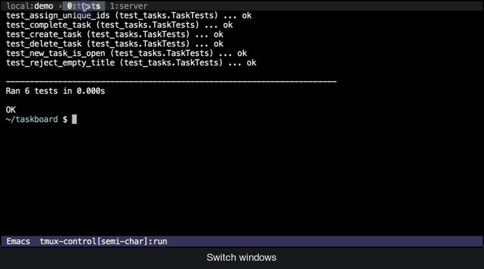
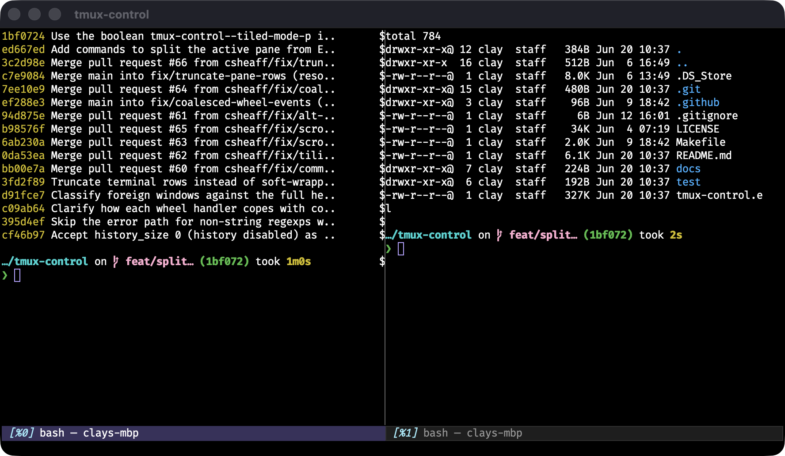
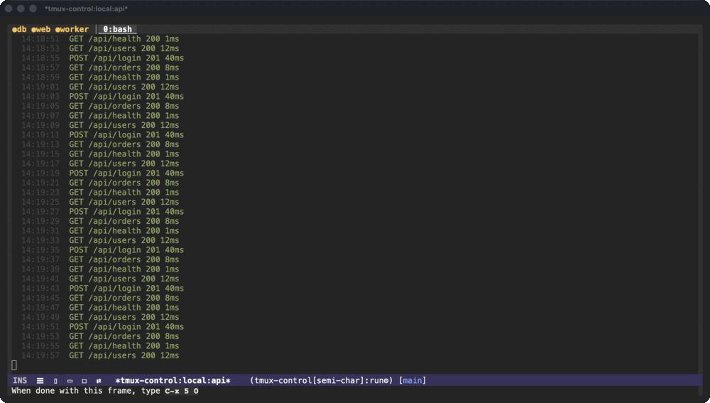

# tmux-control

[](https://github.com/csheaff/tmux-control/actions/workflows/ci.yml)

`tmux-control` turns Emacs into a **control-mode client for a tmux pane** —
the [iTerm2 tmux-integration](https://iterm2.com/documentation-tmux-integration.html)
idea, but in Emacs.



*Switch tmux windows, browse history, and jump back to live output—all inside Emacs.*

Other ways to pair Emacs with tmux either **send it commands**
([`emamux`](https://github.com/emacsorphanage/emamux)), **navigate** between
Emacs windows and tmux panes when Emacs itself runs *inside* tmux
([`tmux-pane`](https://github.com/laishulu/emacs-tmux-pane)), or run tmux
*inside* an Emacs terminal buffer (`vterm`, `eat`, `ansi-term`) — a terminal in
a terminal, with tmux's own status bar and prefix keys.  None of them render
tmux's own panes as Emacs buffers.  `tmux-control` does: it speaks tmux's
**control-mode protocol** (`tmux -C`, the same one iTerm2's native integration
uses), so each live pane becomes an Emacs buffer rendered through
[Eat](https://codeberg.org/akib/emacs-eat) — no nested terminal, no tmux
chrome, just a buffer you navigate, search, and copy from.  The session lives
on a **persistent, possibly remote** server and outlives Emacs: detach,
restart, or reconnect from another machine and the pane is still there.

## Requirements

- **Emacs 29.1+**
- **[Eat](https://codeberg.org/akib/emacs-eat) 0.9.4+** — the terminal renderer
  and a hard dependency (`straight`/`package.el` pulls it in automatically).
- **tmux 3.x** on the target host, local or remote over SSH (flow control needs
  3.2+).
- macOS or Linux.

## Install

With Emacs 30's built-in `use-package` (Emacs 29: `M-x package-vc-install`
with the repository URL):

```elisp
(use-package tmux-control
  :vc (:url "https://github.com/csheaff/tmux-control" :rev :newest))
```

With straight.el:

```elisp
(use-package tmux-control
  :straight (tmux-control :type git :host github :repo "csheaff/tmux-control")
  :custom
  ;; Connection defaults for `M-x tmux-control-connect' — these are examples;
  ;; set them to your own host / socket / session.
  (tmux-control-default-host "dev")          ; an SSH host alias, or nil for local
  (tmux-control-default-socket-name "main")
  (tmux-control-default-session "emacs"))
```

Then `M-x tmux-control-connect`.  The session prompt completes over the
sessions that already exist on the chosen host and socket; selecting one
attaches, typing a new name creates it.

## What it does

- **Live view of a tmux window**, rendered through [Eat](https://codeberg.org/akib/emacs-eat)
  — a normal Emacs buffer you move, search, and copy in, with no nested
  terminal and no tmux chrome.
- **Windows as tabs** in a header-line tab bar, prefixed with a persistent
  `host:session` label so you always know which server and session you are
  looking at, with an activity **dot** on
  background windows; flip them like browser tabs (`C-c C-n` / `C-c C-p`),
  jump straight to one with `C-c 0`…`C-c 9`, or pick from a chooser (`C-c C-w`).
  Each visited window keeps its own scrollback across flips and **keeps
  streaming in the background** — flip back and see everything it printed
  while you were away.
- **Switch between sessions** on the host in place (`C-c C-s`) — each tmux
  session is its own buffer with its own scrollback and tabs. Other connected
  sessions with unseen output are **named in the right corner** of the header
  (grouped by server, so a host is shown once and only when it differs from
  the one you're viewing) — you see *which* session wants you, not just that
  one does; click a name (or `M-x tmux-control-switch-to-flagged`) to jump
  there. Or tile **every session at once** in a live grid (`C-c C-f`,
  experimental).
- **Scrollback** as ordinary Emacs text (`C-c C-e`) — opens instantly however
  deep the history (loaded lazily, extended as you scroll), faithful by
  default, with opt-in compaction of repeated full-screen redraws (toggle with
  `c`). Optionally, scroll the live view's own history in place, iTerm-style,
  rather than opening the pager — enabled by default, and configurable.
- **Tiled view** (`C-c C-t`, experimental) — every pane of a window at once,
  split to match tmux's layout. Visited panes retain their live history across
  window switches, resizing, and untiling, and keep streaming while hidden.
- **Named connections** — save host/socket/session with
  `M-x tmux-control-bookmark-set`, then return using Emacs bookmarks (`C-x r b`).
- **Diagnostics** — `M-x tmux-control-diagnostics` produces a copyable report
  of versions, sizing, terminal modes, bindings, and connection health.
- **Split a pane from Emacs** — `C-c |` (side by side) or `C-c -` (stacked)
  opens a second terminal beside the current one, tiled so both show at once.
- **Persistent & remote** — the session lives on the server and outlives Emacs;
  detach, restart, reconnect from another machine.
- **Optional full TRAMP context** — enable `tmux-control-pane-directory-mode`
  to keep `default-directory` synchronized with the active pane, making
  directory-aware commands such as compile, grep, Consult, and project tools
  naturally operate on the pane's host.
- **Stays responsive** under a flood of output (optional flow control).



*Two panes of one tmux window, side by side — each a live Emacs buffer you
search and copy in, labelled by its pane id in the mode line. Split the active
pane from Emacs with `C-c |` (side by side) or `C-c -` (stacked); both show at
once in the tiled view (experimental).*



*Each connected tmux session is its own buffer; the header corner names the ones
with new output, and `C-c C-f` tiles them all into one live grid (experimental).*

→ Full command and key reference, the tiled view, and tuning live in
**[docs/guide.md](docs/guide.md)**.

## Status

The **single-pane client is stable** and in daily use: attach (local or remote
over SSH), live render through Eat, input, resize, window tabs, scrollback with
redraw-compaction, optional flow control.  Mouse handling and broader edge-case
hardening are still in progress.

The **tiled view** (`C-c C-t`) is **experimental** — it preserves neighboring
code windows and uses the session's own window region, with a
few [known limits](docs/guide.md#tiling) — but renders every pane cell-for-cell
with live per-pane I/O and automatic re-tiling.

## Troubleshooting

**If the live view ever drifts a row or looks scrambled**, press **`C-c C-l`**
(`M-x tmux-control-clear-and-repaint`) — it reseeds the buffer from tmux's own
screen and clears the glitch instantly.  The cause is a bug in Eat's terminal
emulation that drops a display row when a full-screen TUI repaints, so the
offset can accumulate over redraws; it's tracked upstream at
[emacs-eat#263](https://codeberg.org/akib/emacs-eat/issues/263).

**Switching to a window always heals it**: a window's buffer keeps streaming
while you are looking at another one, so it can accumulate that drift in the
background — arriving at it verifies the screen against tmux and repaints only
if they differ (one `capture-pane` per switch, no repaint when it already
matches).

To heal the window you are *already looking at* **automatically**, set
`tmux-control-auto-heal-drift` to non-nil: an idle check then compares the
rendered screen to tmux's own and reseeds a drifted pane on its own.  It's off by default because the check costs
one `capture-pane` round trip per burst of output (taken only when a pane is
displayed, idle, and on the normal screen) — fine on a fast link, your call on
a slow one; see the variable's docstring for the exact gating.

**With Evil**, tmux-control buffers start in insert state so typing reaches the
pane; ESC returns to normal state.  Set `tmux-control-evil-state` to `emacs` to
send ESC to the pane instead, or to nil for Evil's default.

**If ESC switches your modal package's mode instead of reaching the pane**
(xah-fly-keys, evil, viper), that's by design: tmux-control lets the modal
package keep ESC.  To send a real ESC to a TUI, bind
`tmux-control-send-escape` to a free key:

```elisp
(with-eval-after-load 'tmux-control
  (define-key tmux-control-mode-map (kbd "C-c <escape>")
              #'tmux-control-send-escape))
```

For a single ESC, `C-q ESC` also sends it through.  For a long TUI session,
switch to char mode, where every key goes to the pane (see
[docs/guide.md](docs/guide.md)).

## Terminal agent frameworks

Some CLI coding-agent tools run a session per agent in tmux — one **pane** per
agent, or one **window** per agent.  Because tmux-control renders the tmux
session itself, those layouts show up as tiled buffers and window tabs (with
the activity dot flagging which one wants you), with no special handling.  If
that's of interest, see **[docs/agents.md](docs/agents.md)**; if it isn't, you
can ignore it entirely — none of the above depends on it.

## For package authors

Packages built on tmux-control (such as
[Roost](https://github.com/csheaff/roost)) should use these functions,
available since 0.7.0, and require `(tmux-control "0.7.0")`.  Names with a
double dash are internal and may change in any release.

| Function | Purpose |
| --- | --- |
| `tmux-control-connect-or-switch` *host socket session* | Show a session in the selected window, reusing a live connection or connecting |
| `tmux-control-send-command` *command* | Send one tmux command; the reply is discarded |
| `tmux-control-query` *command callback* | Send one tmux command; call *callback* with the reply's lines, or nil on an error |
| `tmux-control-tiled-p` | Whether the current buffer is part of a tiled view |
| `tmux-control-buffer-host` | The current buffer's SSH host, or nil when local |
| `tmux-control-buffer-socket-name` | The current buffer's tmux socket name |
| `tmux-control-buffer-session` | The current buffer's tmux session name |
| `tmux-control-active-pane` | The tmux pane id (`%3`) the current buffer sends input to |
| `tmux-control-window-id` | The tmux window id (`@2`) the current buffer renders, or holding its tiled pane |

Apart from `tmux-control-connect-or-switch`, these act on the current buffer,
which may be a session's buffer or any of its window or tiled-pane buffers.
The accessors return nil in other buffers.

Replies are matched to commands in order, so each *command* must be exactly
one tmux command on one line, starting with the bare command name.  Lines
tmux would not answer exactly once are refused: blank or comment-only lines,
variable assignments, NUL bytes, and an unquoted `;`, `{` or `}` (quote or
escape those to pass them as arguments).  Avoid commands that run other commands, such as `if-shell`:
tmux replies to each command it runs.  The interactive commands, such as
`tmux-control-connect`, `tmux-control-select-pane` and `tmux-control-tile`,
can also be called from Lisp.

## Development

```sh
make test          # pure-logic unit tests (no tmux server required)
```

`eat` must be on the load path; pass `EAT_DIR=/path/to/eat` if it isn't at the
straight.el default.  The live render-fidelity suites (`make test-integration`
and a GUI tiling oracle) are described in the
[guide](docs/guide.md#development).

## License

GPL-3.0-or-later. See [LICENSE](LICENSE).
