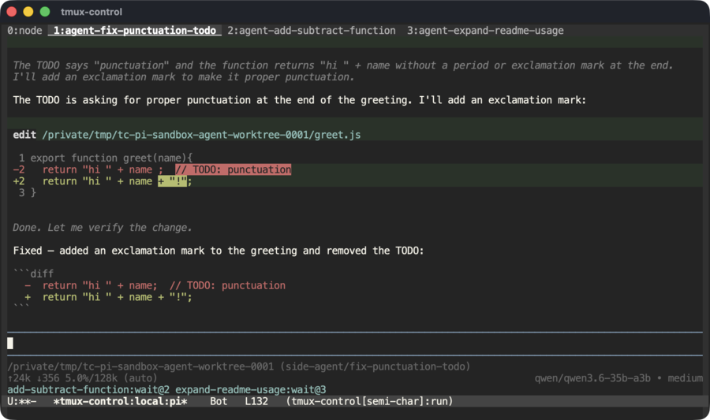

# tmux-control and terminal agent frameworks

`tmux-control` knows nothing about "agents" — it renders a tmux session. But a
growing class of CLI coding-agent tools drive **tmux** as their substrate: they
run each agent in its own tmux pane or window for isolation, persistence, and
so you can watch and steer it. Because those are just tmux panes and windows,
`tmux-control` renders them in Emacs with no special handling — and the window
tab bar, activity dots, and tiled view map onto them directly.

That's the whole appeal: tmux-control is the **substrate** beneath the
orchestration layer, so it benefits from any tool that adopts tmux without
having to chase (or know about) any of them.

## Two layouts

Agent frameworks tend to pick one of two tmux layouts.

### One pane per agent → the tiled view

A single window split into one pane per agent — a team you watch side by side.
Examples: [Claude Code](https://www.anthropic.com/claude-code) in tmux teammate
mode (`teammateMode: tmux`); [`@vanillagreen/pi-agents-tmux`](https://www.npmjs.com/package/@vanillagreen/pi-agents-tmux).

`C-c C-t` (`tmux-control-toggle-tiling`) renders **every pane at once**, each in
its own Emacs buffer, split to match tmux's layout — the iTerm "show every
pane" view. Type into a pane to talk to that agent; the mode line labels each
by id / command / title. Or stay single-pane and cycle through them with
`C-c C-o`.

### One window per agent → window tabs + activity dots

Each agent in its own tmux **window** (often with a dedicated git worktree and
topic branch), spun up and torn down per task.
Example: [`pi-side-agents`](https://www.npmjs.com/package/pi-side-agents) —
`/agent <task>` spawns a background child agent in a new tmux window, and its
statusline tells you which agents are waiting, by window.

In `tmux-control`, each agent window is a **tab** in the header line, named by
whatever the framework called the window (e.g. `agent-fix-auth-leak`). When a
background agent produces output while you're looking elsewhere, a **dot**
appears on its tab — the "which agent wants me?" signal. Switch with
`C-c C-n` / `C-c C-p` or click the tab; visiting it clears the dot.



*A `pi-side-agents` flock in Emacs: the tab bar carries one tab per child
agent, and the focused agent's TUI — its reasoning and a colored edit diff in
its own worktree — renders cell-for-cell.*

## Notes

- **The activity dot is edge-triggered** — "new output since you last looked."
  That fits the live flow (you're on the main console, an agent finishes, its
  tab dots). It does not reconstruct historical state on a *fresh* attach, but
  the framework's own statusline — which tmux-control renders faithfully —
  shows that.
- **None of this is agent-specific in tmux-control.** It is the same generic
  window / pane / tab / dot machinery any tmux session gets; agent tools simply
  exercise it. So a future tool that drives tmux the same way works the same
  way, with no changes here.
- **Scrollback fine-tuning.** An agent TUI that reprints its whole panel each
  turn (common with `alternate-screen off`, which preserves history) can be
  collapsed tightly by pinning its frame top — see *Compacting repeated TUI
  redraws* in the [README](../README.md). For the Claude Code TUI, for example:

  ```elisp
  (setq tmux-control-scrollback-frame-start-regexp "\\`\\s-*\\[Session\\]"
        tmux-control-scrollback-chrome-regexps
        '("\\`\\[Session\\]" "AI Credits:" "\\`/ commands"
          "\\`[─━]\\{10,\\}\\'" "\\`❯\\'"))
  ```
