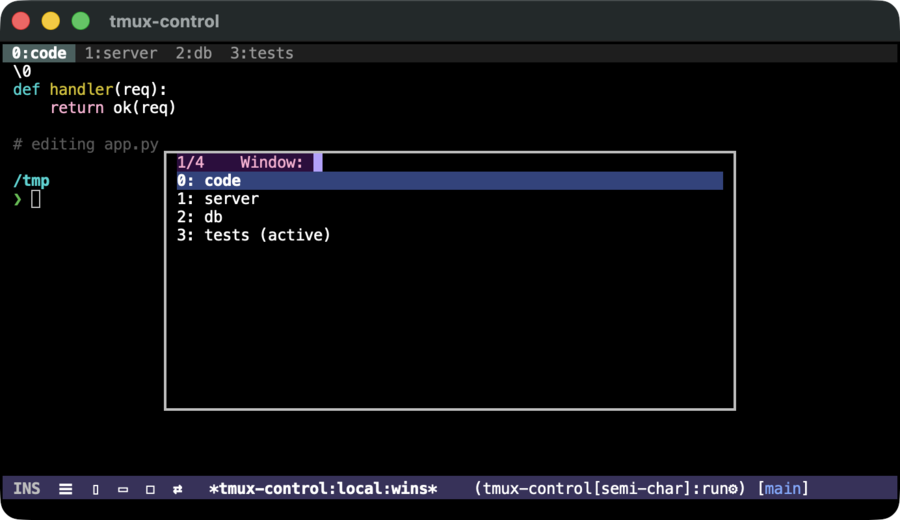
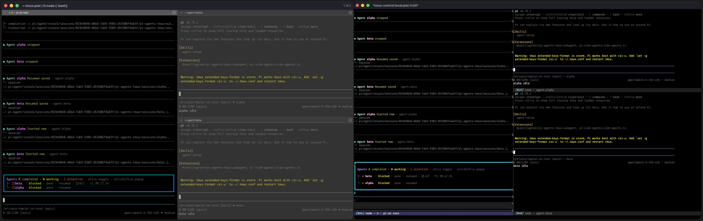

# tmux-control — guide

The full command/key reference, the tiled view, scrollback tuning, and the
test suites. See the [README](../README.md) for the overview, requirements,
and install. Connect with `M-x tmux-control-connect` (the session prompt
completes over existing sessions on the chosen host/socket; a new name creates
that session).

## Window and session management

These commands act on the connected session (`C-c C-n`/`C-c C-p`/`C-c C-s` are
bound in the live buffer; the rest are `M-x`, bind them to taste):

- `M-x tmux-control-select-window` switches the live view to another window.
  By default (`tmux-control-window-preview` = t) it opens a two-pane chooser
  with a live preview of the highlighted window (like tmux's `choose-tree`):
  move with the arrow keys, `n`/`p`, or the mouse, `RET` or click to select,
  `q`/`C-g` to cancel.  Its keys take precedence over modal packages
  (`xah-fly-keys`, `evil`).  Two alternatives:
    - `(setq tmux-control-window-preview 'inline)` keeps selection in the
      **minibuffer** (so your usual completion UI is used) but previews the
      highlighted window **in place** in the live buffer rather than splitting
      the frame — cancelling restores the window you came from.  The live
      preview is driven by [`consult`](https://github.com/minad/consult); with
      consult absent it degrades to a plain prompt.
    - `(setq tmux-control-window-preview nil)` is a plain completion prompt
      with no preview.

  

  *`tmux-control-window-preview` = `inline`: pick a window in the minibuffer
  while the live buffer behind previews the highlighted one (here `0: code`) —
  no split; moving the selection updates the preview, and cancelling restores
  the window you started on.*

- `C-c C-n` (`tmux-control-next-window`) and `C-c C-p`
  (`tmux-control-previous-window`) flip to the next or previous window in the
  session, wrapping around — like a terminal's next/previous-tab keys, with no
  menu and without rearranging your Emacs windows (a code buffer beside the
  live view stays put).  `C-c TAB` (`tmux-control-last-window`) toggles back to
  the window you came from — the alt-tab of windows.  Jump straight to a window
  by number with `C-c 0` … `C-c 9`, or pick from the visual chooser with
  `C-c C-w` (`tmux-control-select-window`).  These delegate to tmux's own
  `next-window`/`previous-window`/`last-window`/`select-window`, so they follow
  the session's window order and any other attached client stays in sync.

  **Each visited window keeps its own buffer** (`tmux-control-window-buffers`,
  default on): a switch swaps buffers instead of repainting one in place, so
  every window keeps its accumulated Emacs-side scrollback across flips — and
  a visited window **keeps streaming while you look at another**, so flipping
  back shows everything it printed in the meantime (an agent's full
  transcript, a build's output), not just its final screen.  Memory grows only
  with windows you actually visit.  Set the option to nil for the old
  repaint-in-place behavior (a switch then discards the previous window's
  scrollback).

  Arriving at a window always shows its **live screen** (tmux's own rule;
  the history above stays one wheel-up away) — however the buffer reaches
  the window: the switch commands, returning from scrollback, a plain
  `C-x b`, a window-configuration restore.  Without this, Emacs would
  restore the window's remembered position in the buffer, which a window
  that kept streaming in the background has long since outgrown.
- `M-x tmux-control-new-window` creates a window (optionally named) and
  switches to it.
- `M-x tmux-control-rename-window` renames a window, with completion over
  the session's windows.
- `M-x tmux-control-kill-window` removes a window after confirmation, with
  completion over the session's windows.

Switching, creating, or removing a window changes the session's active
window, so any other client attached to the same session follows along.

### Switching sessions

A host/socket usually runs **several tmux sessions** (one per project, say).
`tmux-control` gives each its own buffer and control connection — so each keeps
its own scrollback, tab bar, and activity state — and lets you flip between them
like tabs, **in place** in the current window:

- `C-c C-s` (`tmux-control-select-session`) prompts for a session on the same
  host and socket, completing over the ones that exist there, and switches the
  view to it.  Picking a session that is already connected reuses its live
  buffer (no respawn); picking one that exists in tmux but isn't shown yet
  connects it on the spot.  The prompt requires a match, so a typo can't
  accidentally spawn a session — to *create* one, use `M-x
  tmux-control-connect` (which attaches an existing session or creates a new
  one).  With `tmux-control-session-preview` (default t) and `consult`, each
  *already-connected* session is previewed in place as you move through the
  candidates — like the window `inline` preview above — and cancelling restores
  the session you came from.  Set `tmux-control-session-preview` to nil for a
  plain prompt.
- `M-x tmux-control-next-session` and `M-x tmux-control-previous-session` step
  to the next/previous session in tmux's list order, wrapping around — a quick
  way to cycle a small set without the prompt.

Switching replaces the session in the **selected window** (it does not split the
frame or rearrange your other Emacs windows), so a code buffer beside the live
view stays put.  Because every session is its own buffer, you can also just keep
several open and switch with the ordinary `C-x b` / `switch-to-buffer`; the
session commands are the tmux-aware shortcut.

### Which session wants you

When you are looking at one session and **another connected session produces
output**, it is **named in the right corner** of the header line, with a bright
dot — e.g. `worker ●` — the session-level "which one wants me?" signal, and the
companion to the window tab bar's per-window dot.  Names are grouped by server,
so a host is shown once and only when it differs from the one you are viewing: a
sibling session on your own server shows just its name, while a session on
another host is prefixed with that server (and two local servers are kept
distinct by socket).  Click a name to switch to it — or `M-x
tmux-control-switch-to-flagged` — and visiting a session clears it.  The corner
lists only sessions with *unseen* output, so an idle setup shows no extra chrome,
and (like the window dot) the repaint burst from a connect, switch, or resize is
not counted.  When the corner would not fit the window it collapses to a bright
count.  Turn it off with:

```elisp
(setq tmux-control-session-activity nil)
```

### The flock view: every session at once (experimental)

`C-c C-f` (`tmux-control-toggle-flock`) tiles **every connected session** into a
grid — one live cell each — for a dashboard of all your projects (or agents) at
a glance.


*The header corner names each other session with unseen output; `C-c C-f` then
tiles all of them into one live grid — here four sessions streaming at once.*

This is cheap precisely because of the design above: each session is
already its own buffer with its own always-live connection (it streams whether
or not it is on screen), so the flock view is just an Emacs window arrangement
over buffers that are already live — no extra connections.

- Each cell is an ordinary session buffer: its mode line and window tab bar
  label it, every cell updates independently and live, and you can read, switch
  windows in, or type into any session without leaving the overview.
- Each session is sized to its cell while flocked (like the tiled pane view);
  `C-c C-f` again — or `M-x tmux-control-unflock` — returns to the single
  session under point, resized to the full window.
- By default it tiles the sessions you have already connected
  (`tmux-control-connect` / `tmux-control-select-session`).  With a prefix
  argument — `C-u C-c C-f` — it first connects *every* session on the host and
  socket, so one keystroke gives you the whole host.

The flock takes the **whole frame** and resizes each session to its cell, so a
session also attached elsewhere (another client) follows tmux's `window-size`
rule.  (To keep a non-tmux buffer beside a single session instead, the tiled
view above preserves a window sharing the frame; the flock always owns it —
see below.)  Experimental.

#### Watching the flock beside your code

Because the flock owns a whole frame, the clean way to keep a **code buffer in
view at the same time** is a second Emacs *frame* (a separate OS window — put it
on another monitor if you have one).  `M-x tmux-control-flock-other-frame`
creates (or raises) a dedicated *“sessions”* frame and flocks there, leaving
your current frame on your code; re-run it to refresh and raise that frame
(`C-u` connects the whole host first, as above).  The flock and its on/off
state are per-frame, so the two never interfere.

A *single* session needs none of this — the single-pane view is just a buffer,
so put one next to your code with an ordinary `C-x 3` split or pop it to its own
frame with `C-x 5 b`.  And the activity dot is frame-aware: a session is flagged
only when it is not visible on *any* frame, so a sessions frame you can see
won’t throw false dots, and one you’ve hidden will.

### The window tab bar

In the single-pane view, a **tab bar** in the header line lists the session's
windows like iTerm's tmux tabs — `index:name` for each, the current one
highlighted.  It is the at-a-glance map of the session: click a tab to switch
to it, and watch a **dot** appear on any *background* window whose pane
produces output while you are looking elsewhere — the "which window wants
me?" signal.  Visiting a window clears its dot; a window that rings its bell
shows a `!`.

The dot reflects genuine background output: the prompt/redraw burst that a
connect, window switch, or frame resize provokes in every pane is deliberately
*not* counted, so an idle session does not light up.  The bar costs one
terminal row (tmux is sized to match, so nothing clips) and is hidden in the
tiled view, where each pane already carries its own label.  Turn it off with:

```elisp
(setq tmux-control-window-tab-bar nil)
```

## Panes

A tmux window can hold several panes at once (a split layout).  By default
`tmux-control` mirrors **one pane at a time** — the window's active pane,
rendered cleanly (output from the other panes is not interleaved into the
view).  Move between panes with:

- `C-c C-o` (`tmux-control-other-pane`) — cycle to the next pane.
- `M-x tmux-control-select-pane` — jump to a pane by name, completing over
  the window's panes (each labelled by its index, command, and title).

Switching the pane sets the window's active pane, so other clients follow
along and the live view repaints on the chosen pane.

**Split the active pane** to open a second terminal beside the current one:

- `C-c |` (`tmux-control-split-pane-right`) — split side by side, the new pane
  on the right.
- `C-c -` (`tmux-control-split-pane-below`) — split stacked, the new pane below.
- `C-c x` (`tmux-control-kill-pane`) — close the active pane (with confirmation).

A split runs tmux's own `split-window` over the control connection and, by
default, enters the tiled view (below) so both panes show at once — otherwise
the single-pane view would just follow the new active pane and the one you
split from would drop out of sight.  Set `tmux-control-split-pane-tiles` to nil
to leave the view alone and tile yourself (e.g. on a slow remote link, where
the tiling build costs a few extra round trips).

## Tiling

`C-c C-t` (`tmux-control-toggle-tiling`) flips between the single-pane view
and a **tiled** view that renders *every* pane of the current window at
once, each in its own buffer, with the Emacs windows split to match tmux's
own layout — the iTerm "show every pane" view.



*The same live tmux session — a multi-pane window — rendered by iTerm2's
native tmux integration (left) and by the tiled view in Emacs (right):
cell-for-cell the same.*

In the tiled view:

- Every pane updates live and independently; output is routed per pane, so
  nothing is interleaved.
- Type into a pane to send input to it; selecting a pane's Emacs
  window makes it tmux's active pane too (other clients follow).
- Splitting (`C-c |` / `C-c -`, or from tmux), resizing, or closing a pane
  re-tiles automatically, and the mode line labels each pane by its id,
  command, and title.  Set `tmux-control-tiled-hide-mode-line` non-nil to
  drop those per-pane mode lines so the cells sit flush (a gapless,
  iTerm-style grid) at the cost of the labels.
- Resizing the Emacs frame re-divides the tmux window to match, so the
  panes re-fit instead of clipping.
- Each pane is a normal `tmux-control` buffer, so `C-c C-e` scrollback and
  the usual movement/search/copy work in any of them.

For a session with **several multi-pane windows**, tile one window, then
switch windows (`M-x tmux-control-select-window`) to bring another into the
tiled view; each window tiles its own panes, like iTerm's per-window tabs.
`C-c C-t` again (or `M-x tmux-control-untile`) returns to the single-pane
view on the currently active pane.

Tiling is **experimental** and fills the tmux-control buffer's **own window
region**, not the whole frame: a non-tmux window sharing the frame (a code
buffer, notes, a REPL) is preserved, and the panes tile only in the space the
single-pane view occupied.  When the tmux-control buffer already fills the
frame, the tiling fills the frame.  Each pane's terminal is sized to tmux's
grid, so the rendering matches tmux cell-for-cell, and the Emacs windows split
to match.  Re-tiles are debounced and their tmux queries batched, so a busy
remote session is not stalled by layout changes.

Known limitations of the tiled view (none of which affect the single-pane
view):

- Switching windows while tiled rebuilds the new window's pane buffers, so a
  window's Emacs-side scrollback is not kept across a switch.
- A vertical stack spends one row on an Emacs mode line where tmux spends it on
  a pane border, so a stacked pane can sit one row short — but content is never
  clipped.

## Key bindings

- `C-c C-k` disconnects the Emacs control client.
- `C-c C-r` reconnects it — see "Reconnecting" below.
- `C-c C-l` refreshes the live view from tmux's current visible screen without
  sending input to the pane.
- `C-c C-e` opens a normal Emacs scrollback view of the pane (movement/search/
  copy, `g` to refresh, `q`/`RET`/`C-c C-e` to return).  Typing an ordinary
  character also returns to the live pane and forwards that key, so you can
  just start your next command.  (For modal users this fires only on
  self-inserting keys, so command-mode navigation in the read-only buffer is
  preserved.)
- Scrolling up with the mouse wheel also enters the scrollback view (while the
  pane shows its normal screen); a full-screen app that genuinely owns the
  alternate screen keeps its own wheel scrolling instead.  Disable with
  `(setq tmux-control-wheel-enters-scrollback nil)`.
- **Scrolling back down to the bottom returns to the live view** — tmux's own
  copy-mode rule: the gesture that took you into history takes you back out,
  no key to remember.  `ESC` also returns to the live view.

### Continuous live-view scrollback (iTerm-style, opt-in)

```elisp
(setq tmux-control-wheel-scrolls-live-history t)
```

Eat keeps everything that has streamed since you connected as ordinary,
already-colored buffer text above the live screen.  With this enabled,
wheel-up over a normal-screen pane scrolls **that** — in place, in the same
buffer, with no mode switch and no capture round trip — and incoming output no
longer yanks the view back to the bottom while you read (following resumes the
moment you scroll back down or type, exactly like iTerm).  Scrolling back to
the bottom returns to live; scrolling up simply stops at the top of the
retained history.

For the deeper, pre-session history that lives in tmux rather than Eat, use
`C-c C-e` (`tmux-control-scrollback`) — the full pager, unchanged.  (Wheel-up
also opens it directly from the live screen, when the pane is fresh or quiet
enough that its whole history already fits on screen; from there the pager
opens at the same tail, so it is seamless.)

Off by default: it changes how the live view itself answers the wheel, so it
is opt-in. With it off, wheel-up opens the pager immediately.  (Requires
`tmux-control-wheel-enters-scrollback` to remain non-nil.)

A few characteristics worth knowing. The retained history is Eat's own
scrollback (bounded, ~128KB), so it covers this session's output, not the
deeper pre-session history — that is what `C-c C-e` is for. During a **flood**
larger than that buffer, the oldest retained lines (including a spot you had
scrolled up to) are trimmed away and the view drops to the top of what
remains; it does not get yanked to the bottom, and typing your next command
snaps straight back to live. The pager (`C-c C-e`), being a fixed capture, is
the steadier choice for studying history while a pane is gushing output. The
feature is also scoped to the single live view — **tiled** panes keep the
plain pager-on-wheel-up behavior regardless of this setting.

Line numbers are disabled locally in live and scrollback buffers.

## Keys, raw mode, and paste

**By default, ESC reaches the pane the moment you press it** — leaving
vim's insert mode, closing a TUI menu, interrupting an agent, with no
wait for a second key.  (Stock GUI Emacs turns an unbound escape into a
pending meta prefix, so a bare ESC sent nothing until your next
keystroke.)  This is a low-precedence default: a modal package that binds
ESC to leave insert mode — xah-fly-keys, evil, viper — keeps it, because
those bindings sit in a minor-mode map that outranks tmux-control's
major-mode map.  For those users the ESC key switches modes as usual; to
send ESC to the pane they bind `tmux-control-send-escape` to a free key,
or use char mode (below), where every key goes to the pane.

**Sending C-c and friends.**  In the default semi-char mode, `C-c` is the
Emacs prefix, so interrupting the pane's process is `C-c C-c` — the comint
convention.  `C-u`, `C-h`, `C-x` and `M-x` likewise stay Emacs keys.  When
you want the real thing, switch to **char mode**:

- `M-x tmux-control-char-mode` (or Eat's own `C-c M-d`, or click
  `[semi-char]` in the mode line): **every** key goes to the pane — `C-c`
  interrupts instantly, `C-u` kills the shell line, `C-r` searches history,
  exactly like a standalone terminal.
- `C-M-m` (that's `M-RET`) comes back to semi-char mode.  The mode line
  shows `[char]` / `[semi-char]`, and the `C-c` command keys (window
  switching, scrollback, …) apply only in semi-char mode.  The mouse wheel
  still opens scrollback in both.

**Paste rides tmux's own paste buffer.**  Every paste gesture — `C-y`,
`M-y`, `Cmd-V`, the Edit menu, middle-click — loads the text into a tmux
buffer and delivers it with `paste-buffer -p`, so tmux applies **bracketed
paste** exactly when the pane's program asked for it.  A multi-line paste
into a modern shell (zsh, bash ≥ 4.4, fish) arrives as one reviewable
block you confirm with RET, instead of executing line by line on the way
in; programs that never asked (macOS's stock bash 3.2, plain `cat`) get
the plain paste they expect.  This is the same mechanism iTerm2's tmux
integration uses, for the same reason: only tmux knows the pane's
bracketed-paste state.

**A key not doing what you expect?**  `M-x tmux-control-audit-keys` shows,
for every key tmux-control binds, the command it intends and the command
that key *actually* runs in this buffer — so a binding your own
configuration shadows (a silently broken feature) is visible at a glance.
A key marked `overridden` is won by another keymap here; that is a bug if
you expected the tmux-control command, or intended if it is a key
tmux-control yields on purpose (ESC defers to a modal package's
command-mode key — xah-fly-keys, evil, viper — so it shows as
overridden).  Under a modal package the active maps differ by state, so
run it once in insert state and once in command state.

## Opening files from a pane

A tmux-control buffer renders a pane that has its own working directory — and,
for a remote session, lives on another host. So **`find-file` and `dired`
default to that pane's directory, on the pane's host**: from a buffer
mirroring a pane on `dev` sitting in `~/proj`, `C-x C-f` opens at
`/ssh:dev:~/proj/` and you type just the filename, instead of spelling out the
full TRAMP path. `C-x 4 f` does the same in another window (keeping the live
pane in view), and `C-x d` opens Dired there.

The remote path is built with **your configured TRAMP method** for that host
(`tramp-default-method`, or a per-host entry in `tramp-default-method-alist`) —
so if you use a faster backend like [tramp-rpc] the path is `/rpc:dev:…`, not a
hardcoded `/ssh:…`.

[tramp-rpc]: https://github.com/ArthurHeymans/emacs-tramp-rpc

- A prefix argument (`C-u C-x C-f`) opens at this buffer's own **local**
  directory instead, for the occasional local file.
- Only the file-finding commands are pane-aware. The buffer's
  `default-directory` itself stays local and there is no directory tracking, so
  `M-x compile`, `M-x grep`, and similar still run on the machine running
  Emacs — not on the remote host.
- To turn the pane-directory behavior off entirely (back to plain local
  `find-file`), set `tmux-control-pane-aware-find-file` to nil.

## Scrollback

Scrollback loads **lazily**, so the view opens instantly no matter how deep
the pane history is:

- `tmux-control-scrollback-initial-lines` (default `500`) is captured when the
  view first opens — enough to fill a screen with margin, and cheap to
  capture, colorize, and (when compaction is on) collapse, so the pager
  appears immediately.
- Scrolling toward the top loads more, `tmux-control-scrollback-extend-lines`
  (default `2000`) at a time, prepended above what you are reading with your
  viewport held in place — so the cost of older history is paid only for the
  lines you actually look at, in bounded chunks, never all at once.
- `tmux-control-scrollback-lines` (default `10000`) only **caps** how deep the
  lazy extension will go.  Raise it if you routinely scroll back very far; it
  is itself capped by the pane's own tmux `history-limit`.  Because the open no
  longer captures this many lines, a large value here is now cheap.

The capture itself rides the **live control connection** — no separate `tmux`
or `ssh` process — and every chunk arrives asynchronously: the view opens
immediately and fills (and extends) when each reply lands, so a remote
session's network round trip never freezes Emacs.  `g`
(`tmux-control-scrollback-refresh`) re-captures however much history you have
scrolled into, not the full cap.

Scrollback shows pane rows exactly as tmux wraps them at the pane's current
width — tmux re-wraps history when the pane resizes, so the capture always
fits the window.  Resizing the window while in scrollback re-captures
automatically: tmux is asked for the new size and the view re-fills with
history re-wrapped to it.  Set `tmux-control-scrollback-join-wrapped-lines` to join
wrapped rows into single logical lines instead (long commands copy as one
line, and the text re-flows if you widen the window) — at the cost that rows
painted before a resize come back at their old width and wrap as fragments:

```elisp
(setq tmux-control-scrollback-join-wrapped-lines t)
```

### Compacting repeated TUI redraws (opt-in)

Some TUIs repaint by reprinting their whole screen instead of using the
alternate screen — which happens when tmux runs with `alternate-screen off`,
keeping full-screen apps on the normal screen so their history is preserved.
Each repaint is then appended to the pane history, so scrolling back shows the
same screen many times over.

`tmux-control` can collapse those repeats: it detects the repeated frame in the
captured history and shows it once, followed by whatever changed between
repaints (a spinner, a token count, an evolving prompt), so you see the
progression instead of dozens of copies.

It is **off by default** — scrollback is shown verbatim, exactly as tmux
captured it. That is the right default for most setups: tmux keeps
`alternate-screen` *on* by default, so full-screen TUIs use the alternate
screen and never flow into scrollback as repeats in the first place; and on
dense, evolving output (an agent streaming a long answer, where each "frame"
grows rather than repeats) the collapse can elide more than intended. Verbatim
is always faithful. Turn compaction on if you run `alternate-screen off` and
want repeats suppressed:

```elisp
(setq tmux-control-compact-scrollback t)
```

You can also flip it for the current view from inside the pager with **`c`**
(`tmux-control-scrollback-toggle-compaction`) — handy to switch on when a
particular history is repetitive, and off the moment a collapse looks wrong.
The header line shows which mode a press will switch to.

For a particular TUI you can fine-tune the result: pin the frame boundary with
`tmux-control-scrollback-frame-start-regexp` (when auto-detection picks a poor
line — say a busy app whose very top line changes every frame) and drop
volatile per-frame "chrome" (status bars, rules, an evolving prompt) with
`tmux-control-scrollback-chrome-regexps` for an even tighter collapse.  For
example, to pin the frame to a panel whose top is a box-drawing border and
drop a couple of volatile per-frame lines:

```elisp
(setq tmux-control-scrollback-frame-start-regexp "\\`\\s-*╭"  ; the panel's top border
      tmux-control-scrollback-chrome-regexps
      '("\\`[─━]\\{10,\\}\\'" "\\`❯\\'"))            ; a full-width rule, a bare prompt
```

## High-volume output (flow control)

Live `%output` is rendered in batches (one repaint per process-filter chunk),
so a flood — `cat` on a large file, a noisy build, `yes` — streams without
freezing Emacs.  The view still replays every line, so a very large burst
takes a while to drain.

For an upper bound on that, enable tmux's control-mode flow control:

```elisp
(setq tmux-control-pause-after 1)  ;; seconds behind before tmux pauses
```

When the output buffered for this client falls more than that many seconds
behind, tmux pauses the pane; the client reseeds from the current screen and
resumes, so the view jumps to the latest state instead of replaying the
backlog.  It engages only on a genuinely **low-bandwidth** link — Emacs reads
the socket eagerly, so a fast client (even a high-latency-but-fat-pipe SSH one)
keeps up and never triggers it.  Off by default; needs tmux 3.2+.

## Window sizing, and sharing a session with another client

tmux sizes each window from its attached clients according to the
`window-size` option (default **latest**: the most recently active client
wins).  tmux-control asks for the size of your Emacs window on every layout
change, so normally the tmux *window* follows Emacs exactly (in a split
window the active pane is its share of that — the renderer always matches
the pane).  Two situations break the following, and both used to fail
*silently*:

- **A pinned window.**  Any `resize-window` — yours, a script's, another
  tool's — sets that window's `window-size` to `manual` as a side effect,
  after which tmux ignores every client size request.  The view then keeps
  reconciling to a grid that never matches your Emacs window (content
  wrapped for a different width reads as mangled).
- **A competing client.**  With the session also attached in another
  terminal (iTerm2, say), `latest` means whichever client acted last sizes
  the window — every hand-off makes the TUI reflow and repaint.

tmux-control now notices when tmux did not follow a size request, probes the
window's `window-size` in-band, and tells you which case you are in — once,
in the session buffer and the echo area.  **`M-x
tmux-control-adopt-window-size`** resolves either: it sets the rendered
window's `window-size` back to `latest` and resizes it to your Emacs window
on the spot.

When you *want* long-term cohabitation with another client, consider
`set-option -g window-size smallest` on that server (both clients see the
same content, letterboxed to the smaller one) — or keep the other client
detached while working from Emacs.

## Reconnecting

The point of tmux is that the session outlives the client — and the client
should lean on that.  When the control connection dies out from under you (a
dropped SSH link, a closed laptop lid, a killed server process), the session
buffer says so:

    [tmux-control] connection lost (...) -- if the tmux session is still
    running, C-c C-r reconnects

`C-c C-r` (`tmux-control-reconnect`) re-establishes the connection in place,
reusing the buffer's saved host, socket and session — nothing to re-enter,
and the view reseeds from the running session exactly where it is now.  It
works from the live view, a per-window render buffer, a tiled pane, or the
scrollback pager.  Typing into a dead session offers the same reconnect, so
the natural "is this thing on?" keystroke is itself the recovery path.  A
deliberate `C-c C-k` disconnect stays quiet.

## A connection that stops replying

Replies on the control connection are matched to commands strictly in order,
so a reply that never arrives — a hung server, a half-dead SSH link — would
otherwise stall every later command silently.  A watchdog notices when the
oldest pending command has waited longer than `tmux-control-command-timeout`
(default 10 seconds) and says so in the session buffer and echo area, pointing
at `C-c C-r` (`tmux-control-reconnect`).  It never guesses at recovery — a
late reply still pairs with its own command, and the client announces when
one arrives.  Set the timeout to `nil` to disable the watchdog.

## Development

Run the pure-logic unit tests (no tmux server required):

```sh
make test
```

`eat` is a hard dependency, so the runner needs it on the load path.  It
defaults to the straight.el build path; override `EAT_DIR` if yours lives
elsewhere:

```sh
make test EAT_DIR=/path/to/eat
```

A **live integration suite** asserts render fidelity — that what tmux-control
paints into Eat matches tmux's own `capture-pane`, across plain text, colors,
UTF-8 box-drawing, wide/CJK/emoji glyphs, the live `%output` stream, window
switching, and the tab bar's activity flags.  It needs a real tmux on `PATH`
(a dedicated `tc-ert-test` socket; skipped where tmux is absent):

```sh
make test-integration
```

For the GUI multi-pane tiling — which needs a real frame and can't be
checked in batch — `test/tmux-control-live-oracle.el` exposes the same
render-vs-`capture-pane` comparison as commands to run against a live GUI
Emacs while exercising tiling by hand:

```elisp
(load-file "test/tmux-control-live-oracle.el")
(tmux-control-live-compare-all "main")  ;; MATCH/DIFF per tiled pane
```

A **chaos soak** (`test/tmux-control-chaos.el`) drives a live GUI session
through a reproducible random stream of realistic operations — window
switches, the pager, typing, pastes, floods, frame resizes, char-mode
round trips, reconnects, window/pane churn — checking after every step
that the displayed screen matches `capture-pane`, the command queue
drains, no view is stranded, and buffers stay bounded.  Run it against a
throwaway `tmux -L tc-chaos` server (see the file's commentary); the
same seed replays the same sequence:

```elisp
(load-file "test/tmux-control-chaos.el")
(tmux-control-chaos-run 120 1234)   ;; STEPS SEED; nil = clean
```
